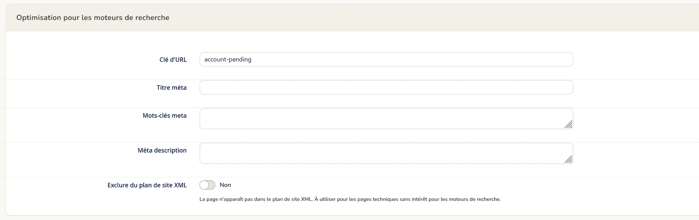

<div align="center">

[English](README.md) · **Français**

# Maxcode Sitemap Exclude CMS pour Magento 2

**Un interrupteur sur chaque page CMS pour la garder hors de votre plan de site XML. Gratuit, sans surcharge du cœur, rien à configurer.**


<!-- Capture à ajouter : docs/images/cms-page-switch.png (voir le guide de publication)

-->

</div>

## Le problème

Le plan de site XML de Magento liste **toutes les pages CMS actives**. Les seules qu'il écarte sont
trois pages « utilitaires » : l'accueil, la page 404 et la page « cookies désactivés ».

Tout le reste finit dans le plan de site remis à Google : la page « compte non approuvé » d'un module
tiers, les pages de confirmation, les pages internes, les pages de test. À ce jour, dans Magento
2.4.8, il n'existe **aucun réglage** pour en retirer une, ni dans *Marketing > SEO & Search > Plan de
site*, ni sur la page elle-même.

## Ce que fait le module

- **Un interrupteur sur chaque page CMS**, dans la section *Optimisation pour les moteurs de
  recherche* : *Exclure du plan de site XML*.
- **Les pages cochées disparaissent de tous les plans de site**, dans toutes les vues de magasin, à la
  génération suivante.
- **Aucune surcharge du cœur :** un seul plugin sur la requête des pages CMS du plan de site. Les
  règles propres à Magento (pages inactives, pages utilitaires, vue de magasin) restent appliquées
  telles quelles et suivent les montées de version.
- **Sans risque par défaut :** une colonne, `cms_page.exclude_from_sitemap`, à `0`. Rien ne change
  tant que vous n'avez coché aucune page.
- **Traduit** en anglais et en français.
- **Tests unitaires** inclus.

<!-- Captures à ajouter : docs/images/sitemap-before.png et docs/images/sitemap-after.png
| Plan de site avant | Plan de site après |
|---|---|
|  |  |
-->

## Installation

```bash
composer require maxcode/module-sitemap-exclude-cms
bin/magento setup:upgrade
bin/magento setup:di:compile
bin/magento cache:flush
```

Aucun contenu statique à déployer : le module ajoute seulement un champ à un formulaire existant de
l'administration.

Prérequis : Magento Open Source ou Adobe Commerce 2.4.x, PHP 8.2 ou supérieur.
Testé sur Magento Open Source 2.4.8-p5 avec PHP 8.3.

## Utilisation

1. Allez dans **Contenu > Éléments > Pages** et ouvrez une page.
2. Dans **Optimisation pour les moteurs de recherche**, passez **Exclure du plan de site XML** sur
   **Oui**, puis enregistrez.
3. Régénérez le plan de site : **Marketing > SEO & Search > Plan de site > Générer**, ou attendez la
   génération planifiée.

> **À savoir.** Le module ne gère que le plan de site. Il n'ajoute pas de `noindex` et ne bloque pas
> l'exploration. Une page déjà connue de Google reste dans son index tant que vous ne le lui
> demandez pas (directive `noindex`, ou demande de suppression dans la Search Console).

## Pour les développeurs

| Élément | Rôle |
|---|---|
| `etc/db_schema.xml` | ajoute `cms_page.exclude_from_sitemap` (`smallint`, non nul, défaut `0`) |
| `view/adminhtml/ui_component/cms_page_form.xml` | l'interrupteur, dans le fieldset `search_engine_optimisation` |
| `Plugin/Sitemap/ExcludeFlaggedPages` | `afterGetCollection` sur `Magento\Sitemap\Model\ResourceModel\Cms\Page` |

Le plugin reçoit les pages que Magento juge éligibles pour une vue de magasin, demande à la base
lesquelles sont cochées (`WHERE exclude_from_sitemap = 1 AND page_id IN (…)`, une requête par vue de
magasin et par génération) et les retire. Aucune `preference`, aucune copie de code de Magento.

Les modules qui remplacent entièrement le générateur de plan de site de Magento ne sont pas couverts.

Pour ne plus utiliser le module : `bin/magento module:disable Maxcode_SitemapExcludeCms`. Les pages
cochées reviennent dans le plan de site à la génération suivante. La colonne est inoffensive et peut
rester en place.

## Historique des versions

Voir [CHANGELOG.md](CHANGELOG.md).

## Licence et support

Gratuit pour un nombre illimité d'installations Magento que vous possédez ou exploitez. Vous recevez
tout le code source et pouvez l'adapter à vos besoins ; la redistribution n'est pas autorisée. Voir
[LICENSE](LICENSE) (CLUF des modules gratuits).

Fourni en l'état, **sans engagement de support ni de mise à jour**. Pour vos questions et les
prestations payantes : [ebusiness360.fr](https://www.ebusiness360.fr/contact/).
